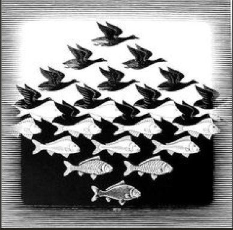
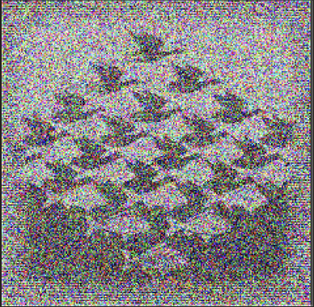

# ImageGenerator
This Project serves as the final project for my C-Programming course. The goal of the project was to be able to recreate a PPM image passed in by the user using a genetic algorithm. 

An example of a sample Input and Output of the Image Generator is below:

